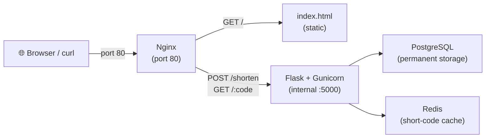

# URL Shortener — Deployment Guide

## Architecture



> [!IMPORTANT]
> Nginx is the **only** public-facing service. Flask, Postgres, and Redis are internal — not bound to any host port.

---

## What Changed (Summary)

| File | What changed |
|------|-------------|
| `app/app.py` | Added `ProxyFix`; short URLs now use real domain via `request.host_url` |
| `app/Dockerfile` | Switched to `gunicorn` with 4 workers |
| `app/requirements.txt` | Added `gunicorn==23.0.0` |
| `nginx/nginx.conf` | **New** — serves frontend + proxies API to Flask |
| `nginx/Dockerfile` | **New** — nginx image with config + HTML |
| `docker-compose.yml` | Added nginx on port 80; Flask is internal-only |
| `frontend/index.html` | Default server address uses same origin |

---

## Running Locally

```bash
docker compose up --build
```

Open **http://localhost** in your browser.

---

## Free / Cheap Hosting — Platform Comparison

| Platform | Truly Free? | Sleep? | Postgres | Redis | Best for |
|----------|------------|--------|----------|-------|---------|
| **Oracle Cloud** ⭐ | ✅ Always free | ❌ Never | ✅ On your VM | ✅ On your VM | **Public, always-on site** |
| **Render** | ⚠️ 30-day DB | ✅ 15 min idle | ⚠️ Expires 30 days | ⚠️ 25MB, not persistent | Testing / portfolio |
| **Railway** | ❌ $5/mo after trial | ❌ Never | ✅ Managed | ✅ Managed | Best dev experience |
| Fly.io | ❌ Pay-as-you-go | ❌ | Pay-as-you-go | Pay-as-you-go | Power users |
| Vercel / Netlify | ❌ Frontend only | — | ❌ | ❌ | Static sites only (not this app) |

> [!NOTE]
> **Vercel and Netlify won't work** for this app — they only host frontend/serverless. This app needs Docker with Postgres + Redis.

---

## Option 1 — Oracle Cloud Always Free ⭐ (Recommended)

**Best for:** A permanent, always-on public URL shortener. No credit card required. Genuinely free forever.

**What you get free:** Up to 4 ARM CPU cores + 24 GB RAM on one VM (more than enough).

### Step 1 — Create a free Oracle Cloud account
Go to [cloud.oracle.com](https://cloud.oracle.com) → Sign up → Choose **Always Free** tier.

### Step 2 — Create a VM instance
1. Console → **Compute → Instances → Create Instance**
2. **Image**: Ubuntu 22.04
3. **Shape**: `VM.Standard.A1.Flex` (ARM, Always Free) — set 2 CPUs, 4 GB RAM
4. **SSH Key**: Upload your public key (or generate one)
5. Note the **Public IP** once it's running

### Step 3 — Open port 80 in Oracle's firewall
1. Console → **Networking → Virtual Cloud Networks → your VCN → Security Lists**
2. **Add Ingress Rule**: Protocol TCP, Source `0.0.0.0/0`, Port `80`
3. Also add port `443` if you plan to add HTTPS later

### Step 4 — SSH into your server and install Docker
```bash
ssh ubuntu@YOUR_SERVER_IP

# Install Docker
curl -fsSL https://get.docker.com | sh
sudo usermod -aG docker $USER
newgrp docker

# Also open port 80 in Ubuntu's firewall
sudo ufw allow 80/tcp
sudo ufw allow 443/tcp
```

### Step 5 — Copy your project to the server
**Option A — Using Git (recommended):**
```bash
# First push your project to GitHub, then on the server:
git clone https://github.com/YOUR_USERNAME/url-shortener.git
cd url-shortener
```

**Option B — Using scp from your Windows machine:**
```powershell
scp -r "C:\Users\abhin\OneDrive\Desktop\Ironfleet\Archives\URL Shortener" ubuntu@YOUR_SERVER_IP:~/url-shortener
```

### Step 6 — Change the Postgres password
Edit `docker-compose.yml` on the server — replace `postgres` with a strong password in the `web` and `db` environment sections:
```bash
nano docker-compose.yml
# Change: POSTGRES_PASSWORD=postgres → POSTGRES_PASSWORD=YourStrongPassword123!
```

### Step 7 — Start the stack
```bash
cd ~/url-shortener
docker compose up -d --build
```

Your site is live at **http://YOUR_SERVER_IP** 🎉

### Step 8 — Add a custom domain + HTTPS (optional but recommended)
If you have a domain (e.g. from Namecheap, Cloudflare), point its A record to your server IP, then:

```bash
# Install Caddy (handles HTTPS automatically)
sudo apt install -y debian-keyring debian-archive-keyring apt-transport-https curl
curl -1sLf 'https://dl.cloudsmith.io/public/caddy/stable/gpg.key' | sudo gpg --dearmor -o /usr/share/keyrings/caddy-stable-archive-keyring.gpg
curl -1sLf 'https://dl.cloudsmith.io/public/caddy/stable/debian.deb.txt' | sudo tee /etc/apt/sources.list.d/caddy-stable.list
sudo apt update && sudo apt install caddy
```

Create `/etc/caddy/Caddyfile`:
```
yourdomain.com {
    reverse_proxy localhost:80
}
```

```bash
sudo systemctl reload caddy
```

Caddy automatically gets and renews an HTTPS certificate. Your site is now at **https://yourdomain.com** ✅

---

## Option 2 — Render (No credit card, easiest setup)

**Best for:** Testing, portfolio projects. Free but has limits (DB expires after 30 days, app sleeps after 15 min idle).

### Step 1 — Push your code to GitHub
```bash
git init
git add .
git commit -m "Initial commit"
git remote add origin https://github.com/YOUR_USERNAME/url-shortener.git
git push -u origin main
```

### Step 2 — Create services on Render
Go to [render.com](https://render.com) → Sign up → **New +**

**Create PostgreSQL:**
- New → PostgreSQL → Free plan → Note the **Internal Database URL**

**Create Redis (Key Value):**
- New → Key Value → Free plan → Note the **Internal Redis URL**

**Create Web Service:**
- New → Web Service → Connect your GitHub repo
- **Environment**: Docker
- **Dockerfile path**: `./app/Dockerfile`
- **Environment Variables** (add these):
  ```
  POSTGRES_HOST     = <from your Render Postgres internal hostname>
  POSTGRES_DB       = urlshortener
  POSTGRES_USER     = <from Render>
  POSTGRES_PASSWORD = <from Render>
  REDIS_HOST        = <from Render Redis internal hostname>
  REDIS_PORT        = 6379
  ```

> [!WARNING]
> Render's free Postgres **expires after 30 days**. You'll need to recreate it and re-enter the credentials.

> [!NOTE]
> On Render you won't use nginx/docker-compose since Render manages the routing. The Flask app is deployed directly via `./app/Dockerfile`. The frontend would be deployed as a separate **Static Site** service pointing to `frontend/index.html`.

### Step 3 — Deploy the frontend as a Static Site
- New → Static Site → Connect same repo
- **Root Directory**: `frontend`
- **Build Command**: (leave empty)
- **Publish Directory**: `.`
- Set **Redirect/Rewrite** rules to proxy API calls: not supported on free tier directly — you'd set the "Server address" in the UI to point to your web service URL.

---

## Option 3 — Railway ($5/month, best experience)

**Best for:** If you want zero friction and don't mind ~$5/month. The developer experience is excellent.

### Step 1 — Push to GitHub (same as above)

### Step 2 — Deploy on Railway
1. Go to [railway.app](https://railway.app) → Sign up
2. **New Project → Deploy from GitHub repo**
3. Railway auto-detects `docker-compose.yml` — click **Deploy**
4. Add **Postgres** plugin: + New → Database → PostgreSQL
5. Add **Redis** plugin: + New → Database → Redis
6. Railway auto-injects `DATABASE_URL` and `REDIS_URL` environment variables

Your app is live on a `*.railway.app` subdomain in minutes.

---

## Useful Commands (on your server)

```bash
# View live logs
docker compose logs -f

# Stop everything
docker compose down

# Stop + delete database (fresh start)
docker compose down -v

# Rebuild after code changes
docker compose up -d --build

# Check container status
docker compose ps

# Restart just the Flask app (after code change)
docker compose restart web
```

---

## Security Checklist Before Going Public

- [ ] Change `POSTGRES_PASSWORD` from `postgres` to something strong
- [ ] Add HTTPS (Caddy or Certbot) if using a custom domain
- [ ] Consider setting `REDIS_PASSWORD` if Redis is exposed (it's internal-only in this setup, so it's fine)
- [ ] Rate limiting is already built in (10 requests/min per IP via Redis)
